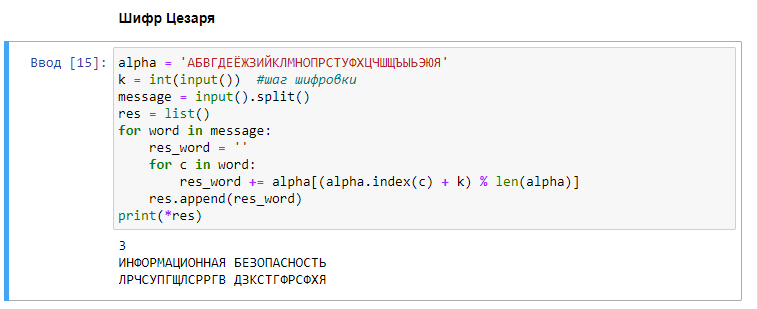
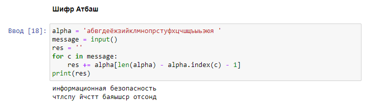

---
## Front matter
title: "Отчёт по лабораторной работе №1"
subtitle: "Дисциплина: Математические основы защиты информации и информационной безопасности"
author: "Полиенко Анастасия Николаевна, НПМмд-02-23"

## Generic otions
lang: ru-RU
toc-title: "Содержание"

## Bibliography
bibliography: bib/cite.bib
csl: pandoc/csl/gost-r-7-0-5-2008-numeric.csl

## Pdf output format
toc: true # Table of contents
toc-depth: 2
lof: true # List of figures
#lot: true # List of tables
fontsize: 12pt
linestretch: 1.5
papersize: a4
documentclass: scrreprt
## I18n polyglossia
polyglossia-lang:
  name: russian
  options:
	- spelling=modern
	- babelshorthands=true
polyglossia-otherlangs:
  name: english
## I18n babel
babel-lang: russian
babel-otherlangs: english
## Fonts
mainfont: PT Serif
romanfont: PT Serif
sansfont: PT Sans
monofont: PT Mono
mainfontoptions: Ligatures=TeX
romanfontoptions: Ligatures=TeX
sansfontoptions: Ligatures=TeX,Scale=MatchLowercase
monofontoptions: Scale=MatchLowercase,Scale=0.9
## Biblatex
biblatex: true
biblio-style: "gost-numeric"
biblatexoptions:
  - parentracker=true
  - backend=biber
  - hyperref=auto
  - language=auto
  - autolang=other*
  - citestyle=gost-numeric
## Pandoc-crossref LaTeX customization
figureTitle: "Рис."
tableTitle: "Таблица"
listingTitle: "Листинг"
lofTitle: "Список иллюстраций"
lotTitle: "Список таблиц"
lolTitle: "Листинги"
## Misc options
indent: true
header-includes:
  - \usepackage{indentfirst}
  - \usepackage{float} # keep figures where there are in the text
  - \floatplacement{figure}{H} # keep figures where there are in the text
---

# Цель работы

Изучить шифры простой замены.

# Задание

1. Реализовать шифр Цезаря с произвольным ключом k.
1. Реализовать шифр Атбаш.

# Теоретическое введение

1. **Шифр Цезаря.**

В основе функционирования шифров простой замены лежит следующий принцип: для получения шифртекста отдельные символы или группы символов исходного алфавита заменяются символами или группами символов шифроалфавита.

Шифр Цезаря (также он является шифром простой замены) - это моноалфавитная подстановка, т.е. каждой букве открытого текста ставится в соответствие одна буква шифртекста. На практике при создании шифра простой замены в качестве шифроалфавита берется исходный алфавит, но с нарушенным порядком букв (*алфавитная перестановка*). Для запоминания нового порядка букв перемешивание алфавита осуществляется с помощью пароля. В качестве пароля могут выступать слово или несколько слов с неповторяющимися буквами. Шифровальная таблица состоит из двух строк: в первой записывается стандартный алфавит открытого текста, во второй - начиная с некоторой позиции размещается пароль (пробелы опускаются), а далее идут в алфавитном порядке оставшиеся буквы, не вошедшие в пароль. В случае несовпадения начала пароля с началом строки процесс после ее завершения циклически продолжается с первой позиции. Ключом шифра служит пароль вместе с числом, указывающим положение начальной буквы пароля. Таблица шифрования на ключе 4 *пароль* будет иметь вид:
 
> а б в г д е ж з и й к л м н о п р с т у ф х ц ч ш щ ь ы ь э ю я

> ы э ю я **п а р о л ь** б в г д е ж з и й к м н с т у ф х ц ч ш щ ъ

В процессе шифрования каждая буква открытого текста заменяется на стоящую под ней букву.

В 1 в. н.э. Ю. Цезарь во время войны с галлами, переписываясь со своими друзьями в Риме, заменял в сообщении первую букву латинского алфавита (А) на четвертую (D), вторую (B) - на пятую (Е), наконец, последнюю - на третью: 

> A B C D E F G H I J K L M N O P Q R S T U V W X Y Z

> D E F G H I J K L M N O P Q R S T U V W X Y Z A B C

Донесение Ю. Цезаря Сенату об одержанной им победе над Понтийским царем выглядело так:

YHOL YLGL YLFL ("Veni, vidi, vici" - лат. "Пришел, увидел, победил"). 

Император Август (1 в. н. э.) в своей переписке заменял первую букву на вторую, вторую - на третью и т. д., наконец, последнюю - на первую: 

> A B C D E F G H I J K L M N O P Q R S T U V W X Y Z 

> B C D E F G H I J K L M N O P Q R S T U V W X Y Z A

Любимое изречение императора Августа выглядело так: 

GFTUJOB MFOUF ("Festina lente" - лат. "Торопись медленно").

Из примеров видно, что изменяя величину сдвига, можно получить несколько разных криптограмм для одного исходного текста.

Математически процедуру шифрования можно описать следующим образом:

$T_m = \{T^j\}, j=0,1, \dots, m-1$

$T^j(a)=(a+j) \: mod \: m$

где $(a+j) \: mod \: m$ - операция нахождения остатка от целочисленного деления $a+j$ на $m$; $T_m$ - циклическая подгруппа. Пронумеруем буквы латинского алфавита от 0 до 25: а = 0, b = 1, c = 3, ... ,z = 25. В латинском алфавите 26 букв и поэтому примем $m=26$. Тогда операцию шифрования запишем в виде: буква с номером $і$ заменяется на букву с номером $(i+3) \: mod \: 26$. Возможно и обобщение шифра Цезаря на случай произвольного ключа $k$: символ с номером $і$ заменится на символ с номером $(i + k) \: mod \: 26$.

Таким образом, открытый текст $a_0, a_1, \dots , a_{N-1}$ преобразуется B криптограмму $T^j(a_0), T^j(a_1), \dots , T^j(a_{N-1})$. При использовании для шифрования подстановки Т~j~ символ а открытого текста заменяется символом $a+j$ шифрованного текста. Цезарь обычно для шифрования использовал подстановку Т^3^.

Взлом такого шифра осуществляется путем анализа частотных характеристик языка открытых текстов. Например, в русском тексте длиной 10000 символов буква О встречается в среднем 1047 раз, Е - 836, А - 808, Н - 723 и т.д. Поэтому, если в достаточно длинной криптограмме какой-то символ встречается чаще остальных, то есть все основания полагать, что это буква О. 

1. Шифр Атбаш.

Данный шифр является шифром сдвига на всю длину алфавита. Для алфавита, состоящего только из русских букв и пробела, таблица шифрования будет иметь следующий вид:

> а б в г д е ж з и й к л м н о п р с т у ф х ц ч ш щ ь ы ь э ю я _

> _ я ю э ь ы ъ щ ш ч ц х ф у т с р п о н м л к й и з ж е д г в б а

Более подробно см. в [@gnu-doc:bash;@newham:2005:bash;@zarrelli:2017:bash;@robbins:2013:bash;@tannenbaum:arch-pc:ru;@tannenbaum:modern-os:ru].

# Выполнение лабораторной работы

1. Реализцем шифр Цезаря с произвольным ключом *k* (рис. @fig:001).

{#fig:001}

1. Реализуем шифр Атбаш (рис. @fig:002).

{#fig:002}

# Выводы

Изучила шифры простой замены на примере шифра Цезаря и шифра Атбаш.

# Список литературы{.unnumbered}

::: {#refs}
:::
