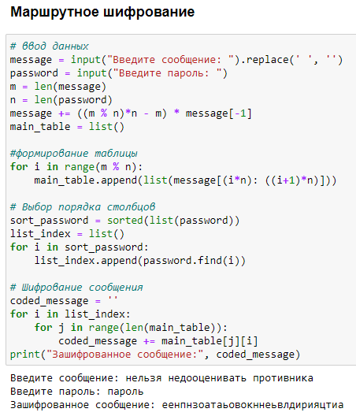
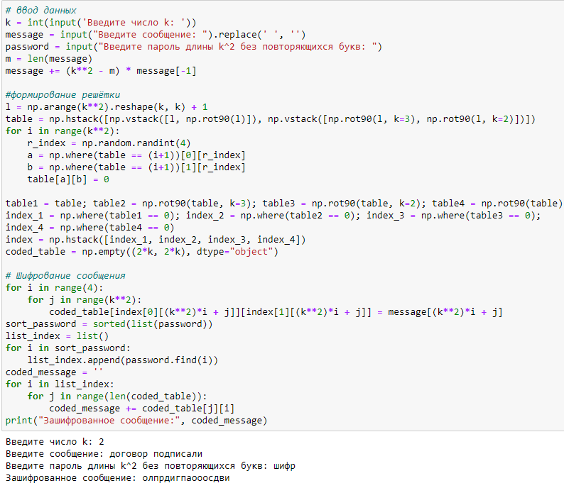
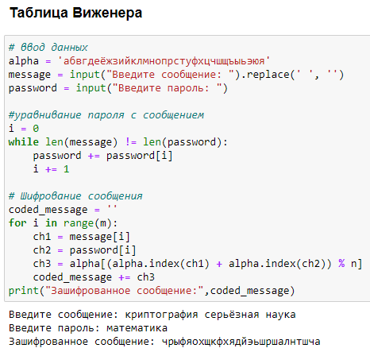

---
## Front matter
title: "Отчёт по лабораторной работе №2"
subtitle: "Дисциплина: Математические основы защиты информации и информационной безопасности"
author: "Полиенко Анастасия Николаевна, НПМмд-02-23"

## Generic otions
lang: ru-RU
toc-title: "Содержание"

## Bibliography
bibliography: bib/cite.bib
csl: pandoc/csl/gost-r-7-0-5-2008-numeric.csl

## Pdf output format
toc: true # Table of contents
toc-depth: 2
lof: true # List of figures
#lot: true # List of tables
fontsize: 12pt
linestretch: 1.5
papersize: a4
documentclass: scrreprt
## I18n polyglossia
polyglossia-lang:
  name: russian
  options:
	- spelling=modern
	- babelshorthands=true
polyglossia-otherlangs:
  name: english
## I18n babel
babel-lang: russian
babel-otherlangs: english
## Fonts
mainfont: PT Serif
romanfont: PT Serif
sansfont: PT Sans
monofont: PT Mono
mainfontoptions: Ligatures=TeX
romanfontoptions: Ligatures=TeX
sansfontoptions: Ligatures=TeX,Scale=MatchLowercase
monofontoptions: Scale=MatchLowercase,Scale=0.9
## Biblatex
biblatex: true
biblio-style: "gost-numeric"
biblatexoptions:
  - parentracker=true
  - backend=biber
  - hyperref=auto
  - language=auto
  - autolang=other*
  - citestyle=gost-numeric
## Pandoc-crossref LaTeX customization
figureTitle: "Рис."
tableTitle: "Таблица"
listingTitle: "Листинг"
lofTitle: "Список иллюстраций"
lotTitle: "Список таблиц"
lolTitle: "Листинги"
## Misc options
indent: true
header-includes:
  - \usepackage{indentfirst}
  - \usepackage{float} # keep figures where there are in the text
  - \floatplacement{figure}{H} # keep figures where there are in the text
---

# Цель работы

Изучить шифры перестановки.

# Задание

1. Реализовать маршрутное шифрование.
2. Реализовать шифрование с помощью решёток.
3. Реализовать шифрование таблицей Виженера.

# Теоретическое введение

Шифры перестановки преобразуют открытый текст в криптограмму путем перестановки его символов. Способ, каким при шифровании переставляются буквы открытого текста, и является ключом шифра. Важным требованием является равенство длин ключа и исходного текста.

Существует два широко распространенных метода перестановок:

1. **Маршрутное шифрование.**

Данный способ шифрования разработал французский математик Франсуа Виет. Открытый текст записывают в некоторую геометрическую фигуру (обычно прямоугольник) по некоторому пути, а затем, выписывая символы по другому пути, получают шифртекст. Пусть $m$ и $n$ - целые положительные числа, большие 1. Открытый текст разбивается на блоки равной длины, состоящие из числа символов, равному произведению $mn$. Если последний блок получится меньше остальных, то в него следует дописать требуемое количество произвольных символов. Составляется таблица размерности $mn$. Блоки вписывается построчно в таблицу. Криптограмма получается выписыванием букв из таблицы в соответствии с некоторым маршрутом. Ключом такой криптограммы является маршрут и числа $m$ и $n$. Обычно буквы выписывают по столбцам, которые упорядочивают согласно паролю: внизу таблицы приписывается слово из  неповторяющихся букв и столбцы нумеруются по алфавитному порядку букв пароля.

2. **Шифрование с помощью решеток.**

Данный способ шифрования предложил австрийский криптограф Эдуард Флейснер в 1881 году. Суть этого способа заключается в следующем. Выбирается натуральное число $k>1$, строится квадрат размерности $k$ и построчно заполняется числами $1, 2, \ddots , k^2$. Повернем его по часовой стрелке на 90° и присоединим к исходному квадрату справа. Проделаем еще дважды такую процедуру и припишем получившиеся квадраты снизу. Получился большой квадрат размерности $2k$.

Далее из большого квадрата вырезаются клетки, содержащие числа от 1 до $k^2$. В каждой клетке должно быть только одно число. Получается своего рода решето. Шифрование осуществляется следующим образом. Решето накладывается на чистый квадрат 2k × 2k и в прорези вписываются буквы исходного текста по порядку их следования. Когда заполнятся все прорези, решето поворачивается на 90° и вписывание букв продолжается. После третьего поворота все клетки большого квадрата окажутся заполненными. Подобрав подходящий пароль (число букв пароля должно равняться $k^2$ и они не должны повторяться), выпишем буквы по столбцам. Очередность столбцов определяется алфавитным порядком букв пароля. 

Важно отметить, что число к подбирается в соответствии с количеством букв $N$ исходного теста. В
идеальном случае $k^2 = N$. Если такого равенства достичь невозможно, то можно либо дописать произвольную букву к последнему слову открытого текста, либо убрать ее.

3. **Таблица Виженера.**

В 1585 году французский криптограф Блез Виженер опубликовал свой метод шифрования в «Трактате о шифрах». Шифр считался нераскрываемым до 1863 года, когда австриец Фридрих Казиски взломал его.

Открытый текст разбивается на блоки длины $n$. Ключ представляет собой последовательность из $n$ натуральных чисел: $a_1, \ddots, a_n$. Далее в каждом блоке первая буква циклически сдвигается вправо по алфавиту на $a_1$ позиций, вторая буква - на $a_2$ позиций, последняя - на $a_n$ позиций. Для лучшего запоминания в качестве ключа можно взять осмысленное слово, а алфавитные номера входящих в него букв использовать для осуществления сдвигов. 

Более подробно см. в [@gnu-doc:bash;@newham:2005:bash;@zarrelli:2017:bash;@robbins:2013:bash;@tannenbaum:arch-pc:ru;@tannenbaum:modern-os:ru].

# Выполнение лабораторной работы

1. Реализуем маршрутное шифрование (рис. @fig:001).

{#fig:001}

2. Реализуем шифрование с помощью решёток (рис. @fig:002).

{#fig:002}

3. Реализуем шифрование таблицей Виженера (рис. @fig:003).

{#fig:003}

# Выводы

Изучила шифры перестановки на примере маршрутного шифрования, шифрования с помощью решёток и шифрования таблицей Виженера.

# Список литературы{.unnumbered}

::: {#refs}
:::
