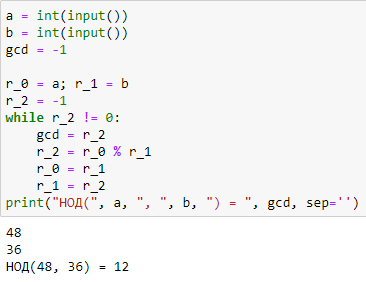
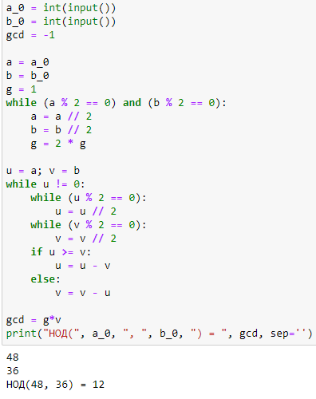
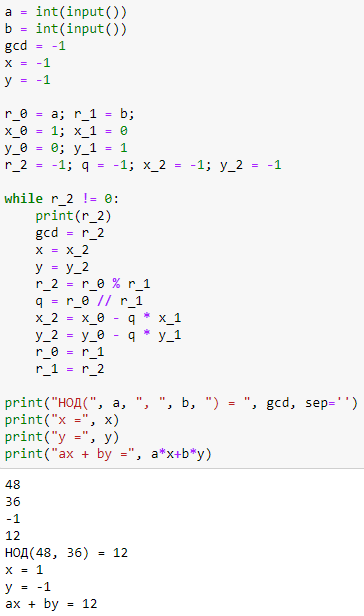
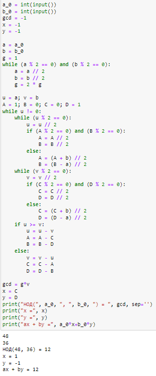

---
## Front matter
lang: ru-RU
title: Лабораторная работа №4
subtitle: Математические основы защиты информации и информационной безопасности
author:
  - Полиенко Анастасия Николаевна
institute:
  - Российский университет дружбы народов, Москва, Россия
  - НПМмд-02-23
date: 25 октября 2023

## i18n babel
babel-lang: russian
babel-otherlangs: english

## Fonts
mainfont: PT Serif
romanfont: PT Serif
sansfont: PT Sans
monofont: PT Mono
mainfontoptions: Ligatures=TeX
romanfontoptions: Ligatures=TeX
sansfontoptions: Ligatures=TeX,Scale=MatchLowercase
monofontoptions: Scale=MatchLowercase,Scale=0.9

## Formatting pdf
toc: false
toc-title: Содержание
slide_level: 2
aspectratio: 169
section-titles: true
theme: metropolis
header-includes:
 - \metroset{progressbar=frametitle,sectionpage=progressbar,numbering=fraction}
 - '\makeatletter'
 - '\beamer@ignorenonframefalse'
 - '\makeatother'
---

# Вычисление наибольшего общего делителя

## Цель лабораторной работы

Изучить алгоритмы вычисления наибольшего общего делителя.

## Задачи лабораторной работы

Реализовать алгоритм Евклида в четырёх его вариациях:

1. Алгоритм Евклида
1. Бинарный алгоритм Евклида
1. Расширенный алгоритм Евклида
1. Расширенный бинарный алгоритм Евклида

# Ход лабораторной работы

## Теоретическое введение

Целое число $d \neq 0$ называется *наибольшим общим делителем* целых чисел $a_1, a_2, \dots, a_k$ (обозначается $d =$ НОД($a_1, a_2, \dots, a_k$)), если выполняются следующие условия:

1. Каждое из чисел $a_1, a_2, \dots, a_k$ делится на $d$;
1. Если $d_1 \neq 0$ - другой общий делитель чисел $a_1, a_2, \dots, a_k$, то $d_1$ делится на $d$.

Для любых целых чисел $a_1, a_2, \dots, a_k$ существует наибольший общий делитель $d$ и его можно представить в виде *линейной комбинации* этих чисел:

$d = c_1 a_1 + c_2 a_2 + \dots + c_k a_k, c_i \in \mathbb{Z}$

## Алгоритм Евклида

## Бинарный алгоритм Евклида

## Расширенный алгоритм Евклида

## Расширенный бинарный алгоритм Евклида

## Выводы

Изучила вычисление наибольшего общего делителя.

