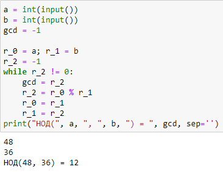
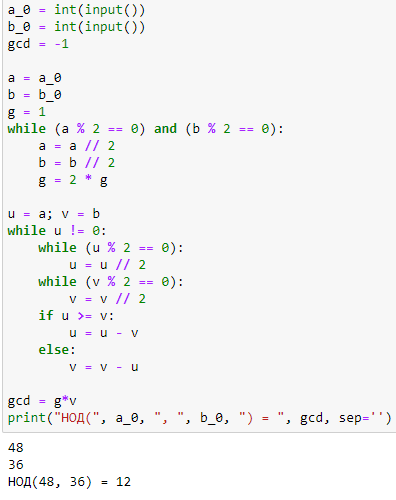
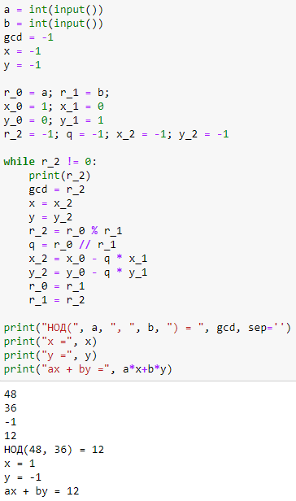
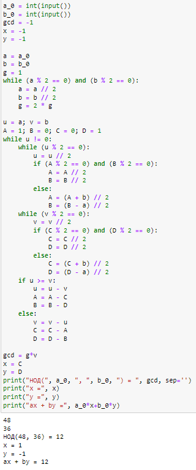

---
## Front matter
title: "Отчёт по лабораторной работе №4"
subtitle: "Дисциплина: Математические основы защиты информации и информационной безопасности"
author: "Полиенко Анастасия Николаевна, НПМмд-02-23"

## Generic otions
lang: ru-RU
toc-title: "Содержание"

## Bibliography
bibliography: bib/cite.bib
csl: pandoc/csl/gost-r-7-0-5-2008-numeric.csl

## Pdf output format
toc: true # Table of contents
toc-depth: 2
lof: true # List of figures
#lot: true # List of tables
fontsize: 12pt
linestretch: 1.5
papersize: a4
documentclass: scrreprt
## I18n polyglossia
polyglossia-lang:
  name: russian
  options:
	- spelling=modern
	- babelshorthands=true
polyglossia-otherlangs:
  name: english
## I18n babel
babel-lang: russian
babel-otherlangs: english
## Fonts
mainfont: PT Serif
romanfont: PT Serif
sansfont: PT Sans
monofont: PT Mono
mainfontoptions: Ligatures=TeX
romanfontoptions: Ligatures=TeX
sansfontoptions: Ligatures=TeX,Scale=MatchLowercase
monofontoptions: Scale=MatchLowercase,Scale=0.9
## Biblatex
biblatex: true
biblio-style: "gost-numeric"
biblatexoptions:
  - parentracker=true
  - backend=biber
  - hyperref=auto
  - language=auto
  - autolang=other*
  - citestyle=gost-numeric
## Pandoc-crossref LaTeX customization
figureTitle: "Рис."
tableTitle: "Таблица"
listingTitle: "Листинг"
lofTitle: "Список иллюстраций"
lotTitle: "Список таблиц"
lolTitle: "Листинги"
## Misc options
indent: true
header-includes:
  - \usepackage{indentfirst}
  - \usepackage{float} # keep figures where there are in the text
  - \floatplacement{figure}{H} # keep figures where there are in the text
---

# Цель работы

Изучить алгоритмы вычисления наибольшего общего делителя.

# Задание

Реализовать алгоритм Евклида в четырёх его вариациях:

1. Алгоритм Евклида
1. Бинарный алгоритм Евклида
1. Расширенный алгоритм Евклида
1. Расширенный бинарный алгоритм Евклида

# Теоретическое введение

Пусть числа $a$ и $b$ целые и $b \neq 0$. Разделить $a$ на $b$ с остатком - значит представить $a$ в виде $a = qb + r$, где $q, r \in \mathbb{Z}$ и $0 \leq r \leq |b|$. Число $q$ называется неполным частным, число $r$ - неполным остатком от деления $a$ на $b$. 

Целое число $d \neq 0$ называется *наибольшим общим делителем* целых чисел $a_1, a_2, \dots, a_k$ (обозначается $d =$ НОД($a_1, a_2, \dots, a_k$)), если выполняются следующие условия:

1. Каждое из чисел $a_1, a_2, \dots, a_k$ делится на $d$;
1. Если $d_1 \neq 0$ - другой общий делитель чисел $a_1, a_2, \dots, a_k$, то $d_1$ делится на $d$.

Например, НОД(12345, 24690) = 12345, НОД(12345, 54321) = 3, НОД(12345, 12541) = 1.

Ненулевые целые числа $a$ и $b$ называются *ассоциированными* (обозначается $a~b$), если $a$ делится на $b$ и $b$ делится на $a$.

Для любых целых чисел $a_1, a_2, \dots, a_k$ существует наибольший общий делитель $d$ и его можно представить в виде *линейной комбинации* этих чисел:

$d = c_1 a_1 + c_2 a_2 + \dots + c_k a_k, c_i \in \mathbb{Z}$

Например, НОД чисел 91, 105, 154 равен 7. В качестве линейного представления можно взять 

$7 = 7 \cdot 91 -6 \cdot 105 + 0 \cdot 154,$

либо

$7 = 4 \cdot 91 + 1 \cdot 105 - 3 \cdot 154$

Целые числа $a_1, a_2, \dots, a_k$ называются *взаимно простыми в совокупности*, если НОД($a_1, a_2, \dots, a_k$) = 1. Целые числа $a$ и $b$ называются *взаимно* простыми, если НОД(*a, b*) = 1.

Целые числа $a_1, a_2, \dots, a_k$ называются *попарно взаимно простыми*, если НОД($a_i, a_j$) = 1 для всех $1 \leq i \neq j \leq k$. 

Более подробно см. в [@gnu-doc:bash;@newham:2005:bash;@zarrelli:2017:bash;@robbins:2013:bash;@tannenbaum:arch-pc:ru;@tannenbaum:modern-os:ru].

# Выполнение лабораторной работы

1. Реализуем алгоритм Евклида нахождения наименьшего общего делителя (рис. @fig:001).

{#fig:001}

2. Реализуем бинарный алгоритм Евклида нахождения наименьшего общего делителя (рис. @fig:002).

{#fig:002}

3. Реализуем расширенный алгоритм Евклида нахождения наименьшего общего делителя и представления его в виде линейной комбинации чисел $a$ и $b$ (рис. @fig:003).

{#fig:003}

4. Реализуем расширенный бинарный алгоритм Евклида нахождения наименьшего общего делителя и представления его в виде линейной комбинации чисел $a$ и $b$ (рис. @fig:004).

{#fig:004}

# Выводы

Изучила алгоритмы нахождения наименьшего общего делителя.

# Список литературы{.unnumbered}

::: {#refs}
:::
