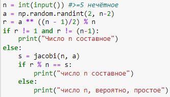

---
## Front matter
lang: ru-RU
title: Лабораторная работа №5
subtitle: Математические основы защиты информации и информационной безопасности
author:
  - Полиенко Анастасия Николаевна
institute:
  - Российский университет дружбы народов, Москва, Россия
  - НПМмд-02-23
date: 25 октября 2023

## i18n babel
babel-lang: russian
babel-otherlangs: english

## Fonts
mainfont: PT Serif
romanfont: PT Serif
sansfont: PT Sans
monofont: PT Mono
mainfontoptions: Ligatures=TeX
romanfontoptions: Ligatures=TeX
sansfontoptions: Ligatures=TeX,Scale=MatchLowercase
monofontoptions: Scale=MatchLowercase,Scale=0.9

## Formatting pdf
toc: false
toc-title: Содержание
slide_level: 2
aspectratio: 169
section-titles: true
theme: metropolis
header-includes:
 - \metroset{progressbar=frametitle,sectionpage=progressbar,numbering=fraction}
 - '\makeatletter'
 - '\beamer@ignorenonframefalse'
 - '\makeatother'
---

# Вероятностные алгоритмы проверки чисел на простоту

## Цель лабораторной работы

Изучить вероятностные алгоритмы проверки чисел на простоту

## Задачи лабораторной работы

Реализовать алгоритм Евклида в четырёх его вариациях:

Реализовать четыре теста на определение простоты чисел:

1. Тест Ферма
1. Символ Якоби
1. Тест Соловэя-Штрассена
1. Тест Миллера-Рабина

# Ход лабораторной работы

## Тест Ферма

## Символ Якоби

## Тест Соловэя-Штрассена 

## Тест Миллера-Рабина

## Выводы

Изучила вероятностные алгоритмы проверки чисел на простоту.

