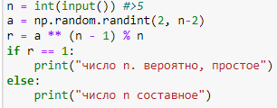
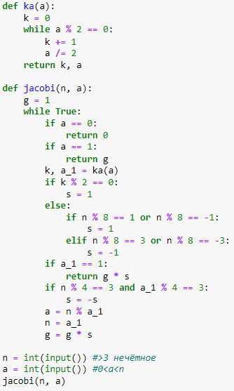
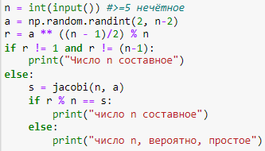
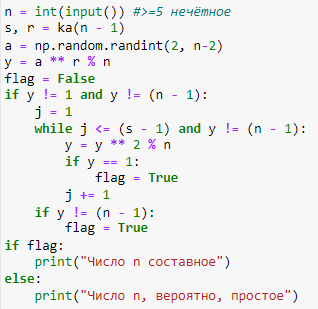

---
## Front matter
title: "Отчёт по лабораторной работе №5"
subtitle: "Дисциплина: Математические основы защиты информации и информационной безопасности"
author: "Полиенко Анастасия Николаевна, НПМмд-02-23"

## Generic otions
lang: ru-RU
toc-title: "Содержание"

## Bibliography
bibliography: bib/cite.bib
csl: pandoc/csl/gost-r-7-0-5-2008-numeric.csl

## Pdf output format
toc: true # Table of contents
toc-depth: 2
lof: true # List of figures
#lot: true # List of tables
fontsize: 12pt
linestretch: 1.5
papersize: a4
documentclass: scrreprt
## I18n polyglossia
polyglossia-lang:
  name: russian
  options:
	- spelling=modern
	- babelshorthands=true
polyglossia-otherlangs:
  name: english
## I18n babel
babel-lang: russian
babel-otherlangs: english
## Fonts
mainfont: PT Serif
romanfont: PT Serif
sansfont: PT Sans
monofont: PT Mono
mainfontoptions: Ligatures=TeX
romanfontoptions: Ligatures=TeX
sansfontoptions: Ligatures=TeX,Scale=MatchLowercase
monofontoptions: Scale=MatchLowercase,Scale=0.9
## Biblatex
biblatex: true
biblio-style: "gost-numeric"
biblatexoptions:
  - parentracker=true
  - backend=biber
  - hyperref=auto
  - language=auto
  - autolang=other*
  - citestyle=gost-numeric
## Pandoc-crossref LaTeX customization
figureTitle: "Рис."
tableTitle: "Таблица"
listingTitle: "Листинг"
lofTitle: "Список иллюстраций"
lotTitle: "Список таблиц"
lolTitle: "Листинги"
## Misc options
indent: true
header-includes:
  - \usepackage{indentfirst}
  - \usepackage{float} # keep figures where there are in the text
  - \floatplacement{figure}{H} # keep figures where there are in the text
---

# Цель работы

Изучить вероятностные алгоритмы проверки чисел на простоту.

# Задание

Реализовать четыре теста на определение простоты чисел:

1. Тест Ферма
1. Символ Якоби
1. Тест Соловэя-Штрассена
1. Тест Миллера-Рабина

# Теоретическое введение

Пусть а - целое число. Числа $\pm 1, \pm a$ называются тривиальными делителями числа а.

Целое число $p \in \mathbb{Z} / \{ 0 \}$ называется простым, если оно не является делителем единицы и не имеет других делителей, кроме тривиальных. В противном случае число $p \in \mathbb{Z} / \{ -1, 0, 1 \}$ называется составным.
Например, числа $\pm 2, \pm 3, \pm 5, \pm 7, \pm 11, \pm 13, \pm 17, \pm 19, \pm 23, \pm 29$ являются простыми.

Пусть $n \in \mathbb{N}, m > 1$. Целые числа а и вназываются сравнимыми по модулю m (обозначается $a \equiv b \ (mod \ m)$) если разность $a - b$ делится на m. Также эта процедура называется нахождением остатка от целочисленного деления а на b.

Проверка чисел на простоту является составной частью алгоритмов генерации простых чисел, применяемых в криптографии с открытым ключом. Алгоритмы проверки на простоту можно разделить на вероятностные и детерминированные.

*Детерминированный* алгоритм всегда действует по одной и той же схеме и гарантированно решает поставленную задачу (или не дает никакого ответа). *Вероятностный* алгоритм использует генератор случайных чисел и
гарантированно точный ответ. Вероятностные алгоритмы в общем случае не менее эффективны, чем детерминированные (если используемый генератор случайных чисел всегда дает набор одних и тех же чисел, зависящих от входных
данных, то вероятностный алгоритм становится детерминированным).

Для проверки на простоту числа n вероятностным алгоритмом выбирают случайной число а $(1 < a < n)$ и проверяют условия алгоритма. Если число n не проходит тест по основанию а, то алгоритм выдает результат «Число п составное», и число п действительно является составным.

Если же n проходит тест по основанию а, ничего нельзя сказать о том, действительно ли число n является простым. Последовательно проведя ряд проверок таким тестом для разных а и получив для каждого из них ответ «Число n, вероятно, простое», можно утверждать, что число n является простым с вероятностью, близкой к 1. После с независимых выполнений теста вероятность того, что составное число и будет t раз объявлено простым (вероятность ошибки),
не превосходит $\frac{1}{2^t}$.

*Тест Ферма* основан на малой теореме Ферма: для простого числа р и произвольного числа а, $1 \leq a ≤ p - 1$, выполняется сравнение

$$a^{p-1} \equiv 1 \ (mod \ p)$$

Следовательно, если для нечетного n существует такое целое а, что $1 \leq a < n$, НОД(а, n) = 1 и $a^{n-1} \neq 1 \ (mod \ n)$, то число п составное. 

Более подробно см. в [@gnu-doc:bash;@newham:2005:bash;@zarrelli:2017:bash;@robbins:2013:bash;@tannenbaum:arch-pc:ru;@tannenbaum:modern-os:ru].

# Выполнение лабораторной работы

1. Реализуем тест Ферма (рис. @fig:001).

{#fig:001}

2. Реализуем алгоритм нахождения символа Якоби (рис. @fig:002).

{#fig:002}

3. Реализуем тест Соловэя-Штрассена (рис. @fig:003).

{#fig:003}

4. Реализуем тест Миллера-Рабина (рис. @fig:004).

{#fig:004}

# Выводы

Изучила вероятностные алгоритмы проверки чисел на простоту.

# Список литературы{.unnumbered}

::: {#refs}
:::
