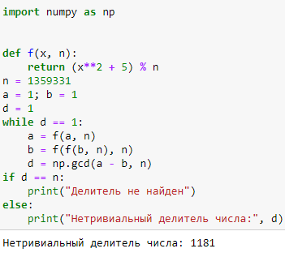

---
## Front matter
title: "Отчёт по лабораторной работе №6"
subtitle: "Дисциплина: Математические основы защиты информации и информационной безопасности"
author: "Полиенко Анастасия Николаевна, НПМмд-02-23"

## Generic otions
lang: ru-RU
toc-title: "Содержание"

## Bibliography
bibliography: bib/cite.bib
csl: pandoc/csl/gost-r-7-0-5-2008-numeric.csl

## Pdf output format
toc: true # Table of contents
toc-depth: 2
lof: true # List of figures
#lot: true # List of tables
fontsize: 12pt
linestretch: 1.5
papersize: a4
documentclass: scrreprt
## I18n polyglossia
polyglossia-lang:
  name: russian
  options:
	- spelling=modern
	- babelshorthands=true
polyglossia-otherlangs:
  name: english
## I18n babel
babel-lang: russian
babel-otherlangs: english
## Fonts
mainfont: PT Serif
romanfont: PT Serif
sansfont: PT Sans
monofont: PT Mono
mainfontoptions: Ligatures=TeX
romanfontoptions: Ligatures=TeX
sansfontoptions: Ligatures=TeX,Scale=MatchLowercase
monofontoptions: Scale=MatchLowercase,Scale=0.9
## Biblatex
biblatex: true
biblio-style: "gost-numeric"
biblatexoptions:
  - parentracker=true
  - backend=biber
  - hyperref=auto
  - language=auto
  - autolang=other*
  - citestyle=gost-numeric
## Pandoc-crossref LaTeX customization
figureTitle: "Рис."
tableTitle: "Таблица"
listingTitle: "Листинг"
lofTitle: "Список иллюстраций"
lotTitle: "Список таблиц"
lolTitle: "Листинги"
## Misc options
indent: true
header-includes:
  - \usepackage{indentfirst}
  - \usepackage{float} # keep figures where there are in the text
  - \floatplacement{figure}{H} # keep figures where there are in the text
---

# Цель работы

Изучить алгоритмы разложения числа на множители.

# Задание

Реализовать алгоритм p-метода Полларда.

# Теоретическое введение

Задача разложения на множители - одна из первых задач, использованных для построения криптосистем с открытым ключом.

*Задача разложения составного числа на множители* формулируется следующим образом: для данного положительного целого числа $n$ найти его каноническое разложение $n = p_1^{\alpha_1} p_2^{\alpha_2} \dots p_s^{\alpha_s}$, где $p_i$ - попарно различные простые числа, $\alpha_i \geq 1$

На практике не обязательно находить каноническое разложение числа $n$. Достаточно найти его разложение на два *нетривиальных сомножителя:* $n = pq, 1 \leq p \leq q < n$. Далее будем понимать задачу разложения именно в этом смысле.

*p-Метод Полларда.* Пусть $n$ - нечетное составное число, $S = \{0,1, \dots, n - 1\}$ и $f: S \rightarrow S$ - случайное отображение, обладающее сжимающими свойствами, например $f(x) = x^2 + 1 \ (mod \ n)$. Основная идея метода состоит в следующем. Выбираем случайный элемент $x_0 \in S$ и строим последовательность $x_0, x_1, x_2, \dots$, определяемую рекуррентным соотношением

$$x_{i+1} = f(x_i),$$

где $і geq 0$, до тех пор, пока не найдем такие числа $і,j$, что $і<j$ и $x_i=x_j$. Поскольку множество $S$ конечно, такие индексы $і,j$ существуют (последовательность «зацикливается»). Последовательность ${x_i}$ будет состоять из «хвоста» $x_0, x_1, \dots, x_{i-1}$ длины $o \left( \sqrt{\frac{nm}{8}} \right)$ той же длины.

Более подробно см. в [@gnu-doc:bash;@newham:2005:bash;@zarrelli:2017:bash;@robbins:2013:bash;@tannenbaum:arch-pc:ru;@tannenbaum:modern-os:ru].

# Выполнение лабораторной работы

Реализуем алгоритм алгоритм p-метода Полларда. (рис. @fig:001)

{#fig:001}

# Выводы

Изучила алгоритмы разложения числа на множители.

# Список литературы{.unnumbered}

::: {#refs}
:::
