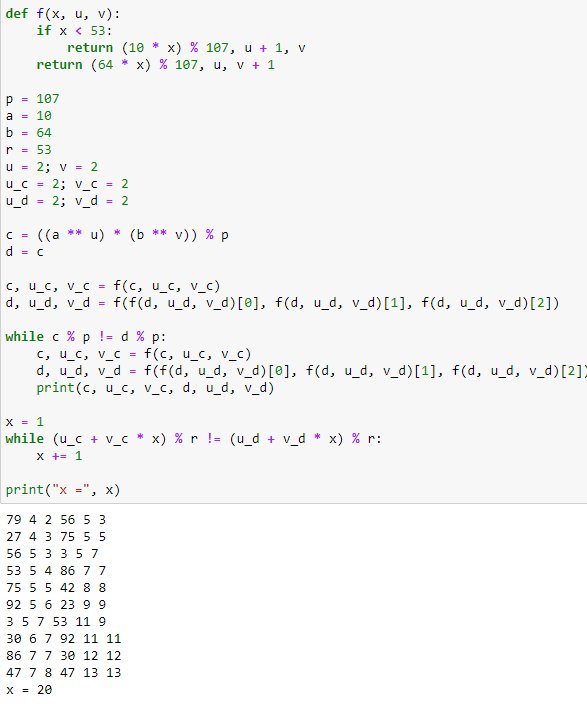

---
## Front matter
lang: ru-RU
title: Лабораторная работа №7
subtitle: Математические основы защиты информации и информационной безопасности
author:
  - Полиенко Анастасия Николаевна
institute:
  - Российский университет дружбы народов, Москва, Россия
  - НПМмд-02-23
date: 26 сентября 2023

## i18n babel
babel-lang: russian
babel-otherlangs: english

## Fonts
mainfont: PT Serif
romanfont: PT Serif
sansfont: PT Sans
monofont: PT Mono
mainfontoptions: Ligatures=TeX
romanfontoptions: Ligatures=TeX
sansfontoptions: Ligatures=TeX,Scale=MatchLowercase
monofontoptions: Scale=MatchLowercase,Scale=0.9

## Formatting pdf
toc: false
toc-title: Содержание
slide_level: 2
aspectratio: 169
section-titles: true
theme: metropolis
header-includes:
 - \metroset{progressbar=frametitle,sectionpage=progressbar,numbering=fraction}
 - '\makeatletter'
 - '\beamer@ignorenonframefalse'
 - '\makeatother'
---

# Дискретное логарифмирование в конечном поле

## Цель лабораторной работы

Изучить дискретное логарифмирование в конечном поле.

## Задачи лабораторной работы

Реализовать алгоритм p-метода Полларда.

# Ход лабораторной работы

## Код

Реализуем алгоритм алгоритм p-метода Полларда. 

## Выводы

Изучила дискретное логарифмирование в конечном поле.

