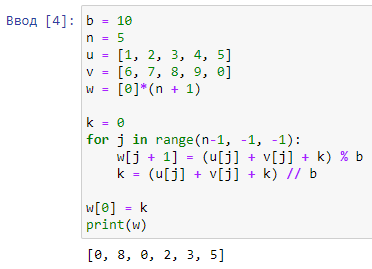
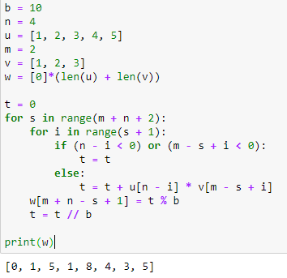
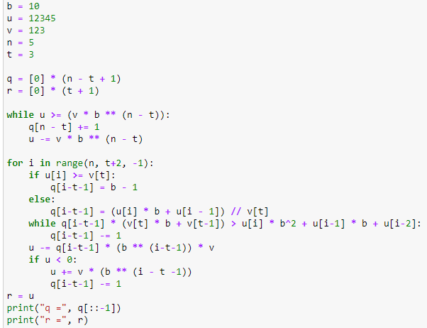

---
## Front matter
lang: ru-RU
title: Лабораторная работа №5
subtitle: Математические основы защиты информации и информационной безопасности
author:
  - Полиенко Анастасия Николаевна
institute:
  - Российский университет дружбы народов, Москва, Россия
  - НПМмд-02-23
date: 25 октября 2023

## i18n babel
babel-lang: russian
babel-otherlangs: english

## Fonts
mainfont: PT Serif
romanfont: PT Serif
sansfont: PT Sans
monofont: PT Mono
mainfontoptions: Ligatures=TeX
romanfontoptions: Ligatures=TeX
sansfontoptions: Ligatures=TeX,Scale=MatchLowercase
monofontoptions: Scale=MatchLowercase,Scale=0.9

## Formatting pdf
toc: false
toc-title: Содержание
slide_level: 2
aspectratio: 169
section-titles: true
theme: metropolis
header-includes:
 - \metroset{progressbar=frametitle,sectionpage=progressbar,numbering=fraction}
 - '\makeatletter'
 - '\beamer@ignorenonframefalse'
 - '\makeatother'
---

# Целочисленная арифметика многократной точности

## Цель лабораторной работы

Изучить алгоритмы целочисленной арифметики многократной точности.

## Задачи лабораторной работы

Реализовать пять алгоритмов целочисленной арифметики:

1. Сложение неотрицательных целых чисел
1. Вычитание неотрицательных целых чисел
1. Умножение неотрицательных целых чисел столбиком
1. Быстрый столбик
1. Деление многоразрядных целых чисел

# Ход лабораторной работы

## Теоретическое введение

Будем считать, что число записано в *b*-ичной системе счисления, *b* - натуральное число, $b \geq 2$. Натуральное *n*-разрядное число будем записывать в виде

$$u = u_1u_2 \dots u_n$$

При работе с большими целыми знак такого удобно хранить в отдельной переменной. Например, при умножении двух чисел, знак произведения вычисляется отдельно.

## Алгоритм сложения неотрицательных целых чисел

## Алгоритм вычитания неотрицательных целых чисел

## Алгоритм умножения неотрицательных целых чисел столбиком

## Алгоритм быстрого столбика

## Алгоритм деления многоразрядных целых чисел

## Выводы

Изучила вычисление наибольшего общего делителя.

