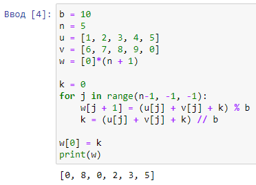
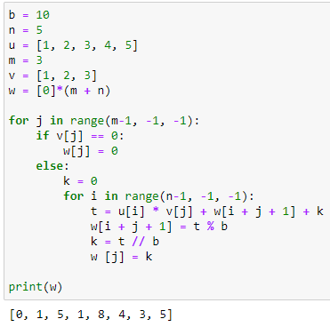
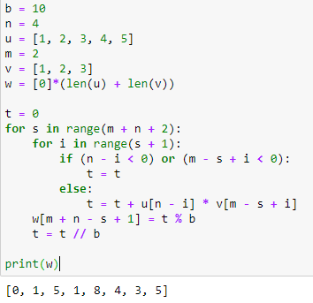
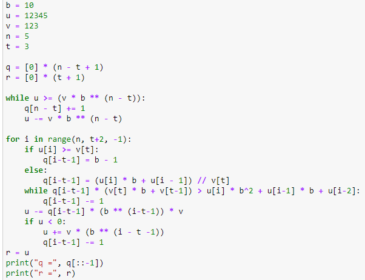

---
## Front matter
title: "Отчёт по лабораторной работе №8"
subtitle: "Дисциплина: Математические основы защиты информации и информационной безопасности"
author: "Полиенко Анастасия Николаевна, НПМмд-02-23"

## Generic otions
lang: ru-RU
toc-title: "Содержание"

## Bibliography
bibliography: bib/cite.bib
csl: pandoc/csl/gost-r-7-0-5-2008-numeric.csl

## Pdf output format
toc: true # Table of contents
toc-depth: 2
lof: true # List of figures
#lot: true # List of tables
fontsize: 12pt
linestretch: 1.5
papersize: a4
documentclass: scrreprt
## I18n polyglossia
polyglossia-lang:
  name: russian
  options:
	- spelling=modern
	- babelshorthands=true
polyglossia-otherlangs:
  name: english
## I18n babel
babel-lang: russian
babel-otherlangs: english
## Fonts
mainfont: PT Serif
romanfont: PT Serif
sansfont: PT Sans
monofont: PT Mono
mainfontoptions: Ligatures=TeX
romanfontoptions: Ligatures=TeX
sansfontoptions: Ligatures=TeX,Scale=MatchLowercase
monofontoptions: Scale=MatchLowercase,Scale=0.9
## Biblatex
biblatex: true
biblio-style: "gost-numeric"
biblatexoptions:
  - parentracker=true
  - backend=biber
  - hyperref=auto
  - language=auto
  - autolang=other*
  - citestyle=gost-numeric
## Pandoc-crossref LaTeX customization
figureTitle: "Рис."
tableTitle: "Таблица"
listingTitle: "Листинг"
lofTitle: "Список иллюстраций"
lotTitle: "Список таблиц"
lolTitle: "Листинги"
## Misc options
indent: true
header-includes:
  - \usepackage{indentfirst}
  - \usepackage{float} # keep figures where there are in the text
  - \floatplacement{figure}{H} # keep figures where there are in the text
---

# Цель работы

Изучить алгоритмы целочисленной арифметики многократной точности.

# Задание

Реализовать пять алгоритмов целочисленной арифметики:

1. Сложение неотрицательных целых чисел
1. Вычитание неотрицательных целых чисел
1. Умножение неотрицательных целых чисел столбиком
1. Быстрый столбик
1. Деление многоразрядных целых чисел

# Теоретическое введение

Будем считать, что число записано в *b*-ичной системе счисления, *b* - натуральное число, $b \geq 2$. Натуральное *n*-разрядное число будем записывать в виде

$$u = u_1u_2 \dots u_n$$

При работе с большими целыми знак такого удобно хранить в отдельной переменной. Например, при умножении двух чисел, знак произведения вычисляется отдельно.

Более подробно см. в [@gnu-doc:bash;@newham:2005:bash;@zarrelli:2017:bash;@robbins:2013:bash;@tannenbaum:arch-pc:ru;@tannenbaum:modern-os:ru].

# Выполнение лабораторной работы

1. Реализуем алгоритм сложения неотрицательных целых чисел (рис. @fig:001).

{#fig:001}

2. Реализуем алгоритм вычитания неотрицательных целых чисел (рис. @fig:002).

{#fig:002}

3. Реализуем алгоритм умножения неотрицательных целых чисел столбиком (рис. @fig:003).

{#fig:003}\

4. Реализуем алгоритм быстрого столбика (рис. @fig:004).

{#fig:004}

5. Реализуем алгоритм деления многоразрядных целых чисел (рис. @fig:005).

{#fig:005}

# Выводы

Изучила алгоритмы целочисленной арифметики многократной точности.

# Список литературы{.unnumbered}

::: {#refs}
:::
